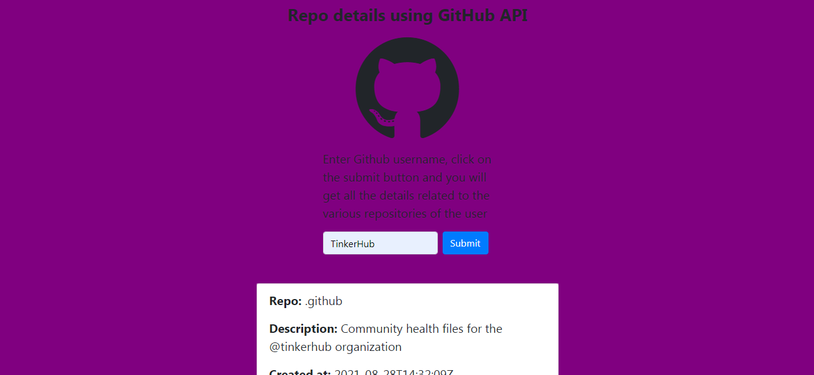

## Hacknight

## Repo details using Github api

This is a web application that displays details of various github  repositories of users on entering their Github username .

## Team Member
1. Jeffin G Benny[https://github.com/JeffinGBenny]

## Built on
Html, CSS, JavaScript

  
## Working of the project

1. On the page  that appears the user needs  enter the github username and  click on the submit button.  
2. On clicking the submit button the details of various  repositories of the user appears.
3. The details include repository name,description, language used, last updated, createdate , no of forks and url.

  
## Features

- Github API
- XMLHttpRequest

  
## Run Locally

Clone the project

bash
  git clone https://github.com/JeffinGBenny/Hacknight

Go to the project directory

bash
  cd Hacknight

Open index.html with any browser

The web app will be available in the browser

  
## Screenshot

  
